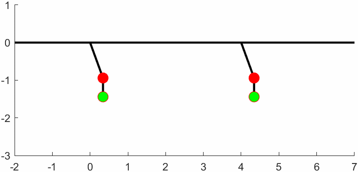
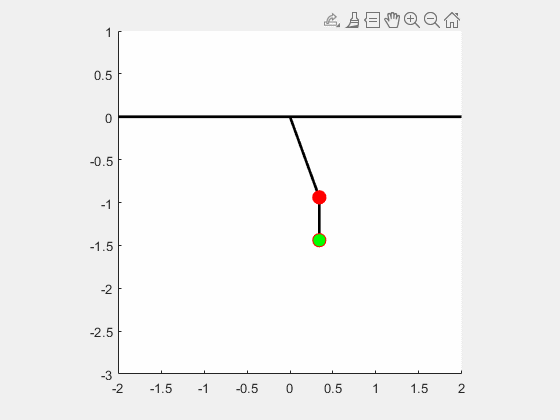
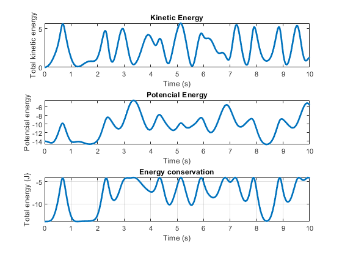

## 🎢 Double Pendulum: A Gateway to Chaos

The double pendulum is a classic example of a nonlinear, chaotic system. Despite its simple structure—two masses connected by rigid rods—it exhibits highly sensitive dependence on initial conditions, making long-term prediction nearly impossible without precise computation.

### 🧠 Lagrangian Formulation

To model the system, we use the Lagrangian approach:

$$
L = T - U
$$

Where \( T \) is the total kinetic energy and \( U \) is the potential energy of both masses. By identifying the system’s degrees of freedom (two angles: $\( \theta_1 \)$ and $\( \theta_2 \)$), we derive the equations of motion using the Euler-Lagrange equations. The result is a set of coupled, nonlinear second-order differential equations that cannot be solved analytically in general.

### First pendulum:

$$
\ddot{\theta}_1 = \frac{-g(2m)\sin(\theta_1) - m g \sin(\theta_1 - 2\theta_2) - 2m \sin(\theta_1 - \theta_2)(\omega_2^2 l + \omega_1^2 l \cos(\theta_1 - \theta_2))}{l(2m - m \cos(2\theta_1 - 2\theta_2))}
$$

### Second pendulum:

$$
\ddot{\theta}_2 = \frac{2 \sin(\theta_1 - \theta_2)(\omega_1^2 l (m + m) + g (m + m) \cos(\theta_1) + \omega_2^2 l m \cos(\theta_1 - \theta_2))}{l(2m - m \cos(2\theta_1 - 2\theta_2))}
$$

These equations describe the full nonlinear dynamics of the system and are typically solved using numerical methods such as Runge-Kutta or Verlet integration.

> For small angles, the system can be linearized using $\( \sin(\theta) \approx \theta \)$, which simplifies the equations and allows for analytical solutions.

---

## 🧮 Two Approaches to Simulation

### 1. **Numerical Methods (MATLAB)**

We solve the system using MATLAB’s built-in solvers:

- `ode45`: A Runge-Kutta method of order 4(5), suitable for non-stiff problems.
- `ode15s`: Designed for stiff systems, useful when the pendulum exhibits rapid transitions.

Additionally, we implement:

- **RK4 (Runge-Kutta 4th Order)**: A fixed-step method that balances accuracy and performance.
- **Verlet Algorithm**: A symplectic integrator that conserves energy better over long simulations. It updates positions based on previous steps and is widely used in molecular dynamics and physics simulations.

These methods allow us to explore the full nonlinear behavior of the double pendulum, including chaotic trajectories and energy exchange between the masses.

### 2. **Small-Angle Approximation**

For small initial angles (typically less than ~20°), we can linearize the system by assuming:

$$
\sin(\theta) \approx \theta
$$

This simplification leads to a linear system that can be solved analytically or with basic numerical methods. While it loses accuracy for larger angles, it provides valuable insight into the system’s harmonic behavior and serves as a benchmark for testing numerical solutions.

<table>
  <tr>
    <td align="center">
       
      <strong>Full Nonlinear Simulation</strong>
    </td>
    <td align="center">
       
      <strong>Small-Angle Approximation</strong>
    </td>
  </tr>
</table>

Despite the fact that numerical methods like 'ode45', 'ode15s' or similar, and similar solvers generally works well, the behaviour of the double pendulum often appears erratic. It seems as though the systems reacts to invisible forces or impulses that disrupt its expected motion. So, what's really happening here? 
The issue lies in numerical noise. The animation we observe is computed with ode45 solver, which - while powerful - introduces small numerical errors at each time step. These errors accumulate over time, especially in chaotic systems like the double pendulum, leading to noticeable deviations in the simulation. How can we address this?

On the other hand, the small-angle approximation produces a more stable simulation.But this raises an inportant questions: how far can the initial angle go before the approximation breaks down?

Interestingly, both questions can we be answered by analyzing a single quantity: total mechanical energy. Energy conservation becomes the useful-key diagnostic tool for evaluating both numerical fidelity and the validity of linear approximations.

**These graphics evaluate the kinetic, potencial and total mechanical energy of the system**

**System Approximation Analysis:**

  

**Real System Analysis:**

  

---

## 🔍 Energy Analysis

To evaluate the validity of the small-angle approximation, we perform an energy analysis across varying initial angles. By comparing total mechanical energy over time, we determine the threshold angle beyond which the approximation fails to conserve energy accurately.

This analysis helps us:

- Quantify the error introduced by linearization
- Validate the performance of numerical solvers
- Understand the transition from predictable to chaotic motion

---

---

> 📝 **Note:** All theoretical developments, as well as the numerical simulations and visualizations, are fully implemented in the code provided in this repository.
