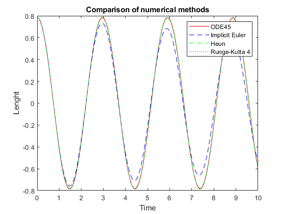
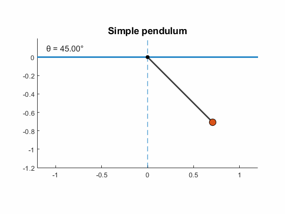
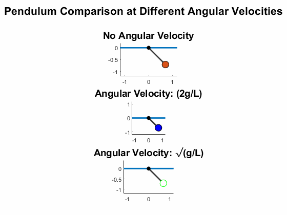
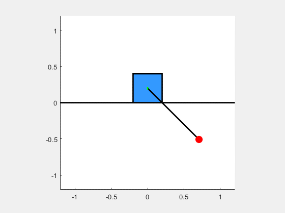

# 🧮 Simple Pendulum Simulation

This module simulates the motion of a simple pendulum using numerical methods. It serves as a foundational example of classical mechanics and demonstrates how Lagrangian dynamics can be applied to derive and solve equations of motion.

## 🎓 Why the Simple Pendulum?

The simple pendulum is one of the few mechanical systems that every physicist should be able to solve analytically. It’s a classic example of a system governed by a second-order differential equation, and it introduces key concepts like:

- Harmonic motion
- Energy conservation
- Small-angle approximation
- Nonlinear dynamics (for larger angles)

In *Mechanics I*, we studied the Lagrangian formulation:

$$
L = T - U = \\frac{1}{2} m l^2 \\dot{\\theta}^2 - mgl(1 - \\cos\\theta)
$$

From this, we derived the equation of motion using the Euler-Lagrange equation:

$$
\\frac{d}{dt} \\left( \\frac{\\partial L}{\\partial \\dot{\\theta}} \\right) - \\frac{\\partial L}{\\partial \\theta} = 0
$$

This leads to the nonlinear differential equation:

$$
\\ddot{\\theta} + \\frac{g}{l} \\sin\\theta = 0
$$

How do we solve these nonlinear equations?
Well, dusting off my numerical methods notebook, I came up with several approaches such as ode45, Heun's methods, Implicit Euler, RK4.




as we can see with the Implicit Euler methods, it fails to preserve the oscillatory behavior, and the numerical tends to decay over time. But, why does it happen? Well, the Implict Euler methods is numericallly dissipative; meaning it causes the system's energy to decay with each time step - although it has not friction or physical damping. Therefore, at each step, the method solves a equation that "looks ahead" in time, which tends to smooth out the oscillatory behavior. This is an inherent feature of the methods. For this reason, implicit schemes like Euler are generally not used in conservative systems (where energy preservation is crucial).
## 🎞️ Animation

To better visualize the pendulum dynamics, you can watch the following .gif animations:

  

  A clean animation of the simple pendulum’s motion, showing angle evolution over time.

  

  A composite animation that compares different initial conditions or behaviors.



  This is just only one of the many combinations of simple harmonic oscillators (SHOs) that we can describe and aniamte. If you'd like to contribute or have other idea: feel free to reach out! 😉


## 📦 Contents

This folder includes the following files:

| File                             | Description                                                                 |
|----------------------------------|-----------------------------------------------------------------------------|
| `Simple_pendulum_combination.m`    | MATLAB script for simulating the simple pendulum                           |
| `Pendulum_combiantion.m`         | MATLAB script combining multiple pendulum behaviors                        |
| `Numerical_methods.m` | MATLAB file with descriptive analysis of the simple pendulum (ode45, implicit Euler and RK4)        |


> All simulations are self-contained. You can modify initial conditions and parameters directly in the scripts.


## 🌀 Alternative Uses of This Calculus

The same mathematical tools used here—Lagrangian mechanics and numerical integration—are widely applicable:

- **Engineering**: Modeling suspension systems, robotic arms, or oscillating components.
- **Quantum Mechanics**: The classical pendulum is a stepping stone to understanding the quantum harmonic oscillator.
- **Cybersecurity**: While less direct, the ability to model dynamic systems and solve differential equations is foundational for cryptographic algorithms and signal analysis.
- **Freelance Projects**: This simulation can be adapted for educational content, interactive visualizations, or physics-based animations in web apps.

## 🚀 How to Run

1. Clone the repository:
   ```bash
   git clone https://github.com/Jorbanejah/Pendulos.git
   cd Pendulos/simple_pendulum
